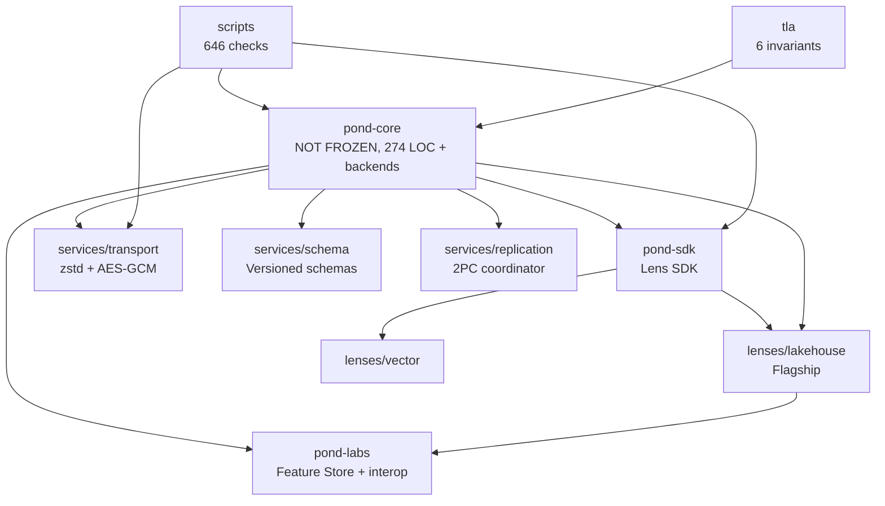

# Pond Knowledge Graph

> **The navigational map of the entire repository.** Every active
> file, every concept, every relationship. **Maintain this file
> whenever the repo changes.**
>
> **Purpose:** Any agent (human or AI) can read this file and have
> complete knowledge of what's in the repo, where it lives, and how
> it connects. Never let this file go stale.
>
> **Maintenance protocol:** See §6. Update this file on every commit
> that adds, removes, moves, or renames a file.

---

## 0. How to use this file

1. **New to Pond?** Read §1 (architecture overview) and §2 (file map).
2. **Looking for a specific file?** Use §2 (file map) or §3 (concept map).
3. **Want to understand relationships?** Read §4 (dependency graph).
4. **Writing a new Lens?** Read §5 (Lens roadmap) and `docs/LENS_GUIDE.md`.
5. **Maintaining this file?** Read §6 (maintenance protocol).

---

## 1. Architecture Overview

```
┌─────────────────────────────────────────────────────────────────┐
│ Applications (SQL, Git, Feature Store, Notebook, Lakehouse)     │
├─────────────────────────────────────────────────────────────────┤
│ Lenses (encode/decode; interpretation layer)                    │
│  • lenses/lakehouse/python/  • lenses/vector/python/                          │
│  • archive/pond-sql/  • archive/pond-git/  (reference impls)    │
├─────────────────────────────────────────────────────────────────┤
│ Services (cross-cutting; between kernel and lenses)             │
│  • services/transport/  • services/schema/  • services/replication/ │
├─────────────────────────────────────────────────────────────────┤
│ SDK (PondLens base, KeyValueLens, ProllyTreeIndex, indexes, query) │
│  • bindings/python/sdk/                                                    │
├─────────────────────────────────────────────────────────────────┤
│ Kernel (NOT FROZEN; 3 ops + batch I/O helpers; 274 LOC)        │
│  • bindings/python/core/kernel.py                                    │
├─────────────────────────────────────────────────────────────────┤
│ Backend (local disk, S3, IPFS, FDB — pluggable)                 │
└─────────────────────────────────────────────────────────────────┘
```

**The 7 design principles** (see `DESIGN_GOALS.md` §3):
Simple, Powerful, Performant, Scalable, Efficient, Beautiful, Functional.

**The 3 kernel operations**: `Write(bytes)→hash`, `Read(hash)→bytes`,
`Ref(name,hash)→()`.

**The 6 substrates**: Bytes, Names, Time, Coordination, Range-Read, Key.

**The 17 formal algebras** (see `docs/POND_FORMAL_ALGEBRAS.md`):
Reference, Merge, GC, RTT, OSN, Physical Structure, Workspace, History,
Substrate, Manifest, Range Read, State-vs-Bytes, GC-with-Packs, PS Dep
Graph, Concurrency, Replication, Transport, Schema Evolution.

---

## 2. File Map (every active file)

### 2.1 bindings/python/core/ (Kernel + storage backends)

> **Honesty note (Task 65).** The kernel is no longer "~140 LOC / FROZEN."
> `bindings/python/core/kernel.py` is 274 LOC and exposes 3 core operations
> (`write`, `read`, `reference`) plus batch I/O helpers (`write_batch`,
> `read_blob_batch`, `read_blob`) and ref-namespace helpers (`resolve`,
> `list_names`). The batch helpers are same-collection performance
> primitives — NOT cross-collection atomicity. See `DESIGN_GOALS.md` §3.1
> for the corrected wording.

| File | LOC | Purpose |
|---|---|---|
| `bindings/python/core/kernel.py` | 274 | The kernel. `PondMinimal` with `write`, `read`, `read_blob`, `write_batch`, `read_blob_batch`, `reference`, `resolve`, `list_names`. SHA-256 content addressing + SQLite-backed root namespace (object-store-native kernel has no SQLite). 6 substrates, 3 operations + batch I/O helpers (not FROZEN). |
| `bindings/python/core/object_store_native_kernel.py` | — | `ObjectStoreNativeKernel` + `InMemoryObjectStore` + `make_object_store_native_kernel`. No SQLite — refs are content-addressed blobs in the object store. The production kernel backend. |
| `bindings/python/core/local_fs_object_store.py` | 443 | `LocalFSObjectStore`. Pure local-filesystem content-addressed store (blobs at `{base}/blobs/{hash[:2]}/{hash}.bin`, refs at `{base}/paths/{path}`). Thread-safe (per-hash locks + fcntl/msvcrt CAS). Mirrors the S3 key layout — `rsync` migrates between them. |
| `bindings/python/core/s3_object_store.py` | 519 | `S3ObjectStore`. Real boto3-backed content-addressed store implementing the same 9-primitive interface as `InMemoryObjectStore` / `LocalFSObjectStore`. S3 conditional PUT (If-Match/If-None-Match) for CAS on small path blobs. |
| `bindings/python/core/s3_mock_backend.py` | — | S3 mock with simulated latency. Extends `ObjectStoreNativeKernel`. Used by latency-injection benchmarks. |
| `bindings/python/core/make_kernel.py` | 112 | `make_kernel(url, **kwargs)`. Unified kernel factory — `file://` → `LocalFSObjectStore`, `s3://` → `S3ObjectStore`. Switching backends is one line; everything else (kernel, SDK, lenses) is identical. |
| `bindings/python/core/__init__.py` | 0 | Package marker. |
| `bindings/python/core/README.md` | 43 | Folder purpose and usage. |

### 2.2 bindings/python/sdk/ (Lens SDK — 14 files, ~7300 LOC)

| File | LOC | Exports | Purpose |
|---|---|---|---|
| `bindings/python/sdk/base_lens.py` | 248 | `PondLens` | **Shared namespace base for ALL Lenses.** Provides only ref-namespace operations (branch, list_collections, set_definition, get_definition, history). No format awareness — each app-facing lens owns its own read/write API. |
| `bindings/python/sdk/prolly_tree.py` *(archived)* | 764 | `ProllyTree`, `ProllyLensBase` | **LEGACY** — ProllyTreeIndex storage + tiered commits. This file does NOT exist in the production SDK; it lives in `archive/legacy-sdk/prolly_tree.py` as historical reference. The actual universal storage backend is `bindings/python/sdk/extensions/physical_structures/unified_storage.py` (5,540 LOC). |
| `bindings/python/sdk/collection.py` | 517 | `Collection` | Named collection with namespace, type, source metadata. |
| `tests/lens_algebra/lens_laws.py` | 591 | (test harness) | RFC-0007 Lens algebra property tests (6 laws). |
| `tests/architecture/architecture_laws.py` | 557 | (12 laws) | Executable architecture laws (Identity, Reachability, History, Lens, Derived, Branch, Merge, Determinism, Scale, Index). |
| `bindings/python/sdk/binary_encoding.py` | 323 | `BinaryProllyTree` | Binary Prolly tree encoding (metadata optimization). |
| `tests/integration/test_shared_lenses.py` | 442 | (tests) | Test: multiple KeyValueLens subclasses sharing same byte graph. |
| `tests/integration/test_lens_architecture.py` | 449 | (tests) | Test: multi-Lens architecture proof (SQL/Git/Notebook lenses over same byte graph). |
| `bindings/python/sdk/row_query.py` | 288 | `LensQuery`, `JoinedQuery` | Lazy query API: `.where()`, `.select()`, `.map()`, `.join()`, `.collect()`. |
| `tests/integration/test_lens_query.py` | 327 | (tests) | Test: LensQuery. |
| `tests/integration/test_pruning.py` | 320 | (tests) | Test: Vortex-style pruning. Zone-map-based pruning works for JSON, Parquet, and custom formats. |
| `tests/integration/test_lakehouse_pruning.py` | 130 | (tests) | Test: End-to-end pruning with LakehouseLens. Zone maps auto-built at write time, read_with_pruning skips row groups. |
| `tests/integration/test_kv_pruning_and_projection.py` | 130 | (tests) | Test: KV pruning + Lakehouse projection pushdown. Zone maps for KV, column-level access for Parquet. |
| `tests/integration/test_collection_metadata.py` | 120 | (tests) | Test: Collection integration — unified namespace + labels + zone maps + indexes + pruning + compaction. |
| `tests/integration/test_index_modes.py` | 220 | (tests) | Test: EAGER/LAZY index modes + O(changed) incremental refresh via commit-diff + is_index_stale. |
| `bindings/python/sdk/maintenance.py` | 315 | `drop_name`, `is_dropped`, `resolve_active`, `compact_tombstones` | Tombstone helpers (RFC-0008: deletion as data). |
| `bindings/python/sdk/collection_metadata.py` | 343 | `CollectionMetadata` | Data-side metadata manager. Manages zone maps, indexes, and (future) bloom filters for collections. Lens-agnostic — works through callbacks. |
| `bindings/python/sdk/best_effort.py` | 95 | `best_effort, warn_best_effort` | Tiny helper for best-effort operations. Catches specific recoverable exceptions (AttributeError, KeyError, TypeError, ValueError, ImportError, ArithmeticError) and logs them via the `pond.best_effort` logger. Replaces the `except Exception: pass` anti-pattern. Enable with `POND_DEBUG=1`. |
| `bindings/python/sdk/pond_config.py` | 195 | `PondConfig` | Persistent pruning + encoding settings via `.pond/config` JSON file. Configures pruning (auto/true/false + force), encoding (auto-select or default), chunk_size, row_group_size, bitpack_max_bitwidth. `should_prune()` decides based on storage type. `load_for_kernel()` finds config in base_dir. |
| `tests/integration/test_pond_config.py` | 130 | (test) | Tests PondConfig: defaults, save/load round-trip, should_prune (auto/true/false/force), encoding hints, validation, load_for_kernel. |
| `bindings/python/sdk/uuid7.py` | 180 | `uuidv7`, `uuidv7_monotonic`, `uuidv7_timestamp` | UUIDv7 time-ordered UUID generation for distributed row identification (_rowid). |
| `bindings/python/sdk/hlc.py` | 116 | `HLC` | **Hybrid Logical Clock** — clock-skew-safe versioning for CRDT LWW. Combines physical time + logical counter; monotonic under clock skew. 16-byte (8B physical_ms + 8B logical, big-endian) hex string sorts chronologically. `tick()` advances, `observe()` accounts for remote writes, `compare` / `max` / `is_valid` helpers. Standard CockroachDB/YugabyteDB-style fix for B5 (UUIDv7 wall-clock skew breaks LWW). |
| `tests/lens_algebra/run_lens_laws_ci.py` | 267 | (CI runner) | CI runner for Lens contracts. |
| `bindings/python/sdk/__init__.py` | 0 | Package marker. |
| `bindings/python/sdk/README.md` | 52 | Folder purpose and usage. |
| `bindings/python/sdk/extensions/__init__.py` | 55 | `register_extension`, `list_extensions` | Extension registry. |
| `bindings/python/sdk/extensions/indexing/__init__.py` | 27 | `SimpleIndex`, `AutoIndexMixin`, `AutoIndex` | Indexing extension package. Collection-level indexing + legacy lens-mixin approach. |
| `bindings/python/sdk/extensions/indexing/collection_index.py` | 200 | `SimpleIndex` | Collection-level indexer. Operates on kernel + collection name. Any lens can use it. Indexes belong to collections (data-side), not lenses. |
| `bindings/python/sdk/extensions/indexing/base.py` | 80 | `SimpleIndexInterface` | Abstract interface for collection-level indexers. |
| `bindings/python/sdk/extensions/semantic/__init__.py` | 15 | — | Semantic extension package. |
| `bindings/python/sdk/extensions/semantic/base.py` | 45 | `SemanticModelAdapter` | Abstract interface for semantic adapters. |
| `bindings/python/sdk/extensions/semantic/ossie.py` | 300 | `SemanticLens`, `OssieAdapter` | Ossie adapter + pluggable SemanticLens. |
| `bindings/python/sdk/extensions/indexing/hnsw_index.py` | 613 | `HNSWIndex` | **HNSW (Hierarchical Navigable Small World) graph-based ANN for vectors.** Multi-layer graph: O(log N) search vs IVF's O(n_probe × cluster_size). Build reads all vectors, constructs layered adjacency lists, stores as content-addressed blobs. VectorLens.search() checks IVF first, then HNSW, then linear scan. Format: `PHNS` magic + layer/node/edge binary layout. |
| `bindings/python/sdk/extensions/indexing/ivf_index.py` | 481 | `IVFIndex` | **IVF (Inverted File Index) ANN.** k-means clusters + per-cluster vector ID lists. **Honesty note (Task 65):** the implementation currently reads ALL vectors via `storage.read(collection)` then filters by target IDs in Python — every search reads the entire collection. At PB scale (10M+ vectors) this defeats the purpose of IVF. Admitted in source comments (lines 363-381). Listed as a Known Gap in `DESIGN_GOALS.md`. |
| `bindings/python/sdk/extensions/maintenance/vacuum.py` | 476 | `GarbageCollector` | **GC + Vacuum** — reclaim space from unreachable blobs. `collect()` builds the live set (read-only) and returns dead set. `vacuum(collections, preserve_days, dry_run)` deletes dead blobs with optional time-travel preservation (Delta/Iceberg-style). PB-scale: O(live) reads (not O(all)); skips dead-blob size reads. |
| `bindings/python/sdk/extensions/physical_structures/__init__.py` | 52 | — | Physical Structure extension package. |
| `bindings/python/sdk/extensions/physical_structures/unified_storage.py` | 5540 | `UnifiedStorage`, `PND2` | **The actual universal storage backend** (5,540 LOC — not "tiny"). PND2 format write/read/point_lookup/iter_rows/compact_manifest + shard read/append paths. Read paths: range read, point lookup, manifest-level compaction. Used by every production Lens. **The docs previously named `bindings/python/sdk/prolly_tree.py` here — that file does NOT exist; the prolly tree lives in `archive/legacy-sdk/prolly_tree.py` as a reference impl.** |
| `bindings/python/sdk/extensions/physical_structures/collection_manifest.py` | — | `CollectionManifest` | ONE manifest blob per commit (PMAN format): row groups + inline stats + delta-manifest support. Delegates stats to `stats_tree.py`. Referenced by `unified_storage.py`. |
| `bindings/python/sdk/extensions/physical_structures/stats_tree.py` | — | `StatsTreeReader` | PB-scale hierarchical stats index. O(log N) reads for selective predicates by walking a stats tree instead of flat zone maps. |
| `bindings/python/sdk/extensions/physical_structures/embedded_stats.py` | — | `ColumnStats`, value-type constants | Per-column stats (min/max/null_count) embedded in manifests. |
| `bindings/python/sdk/extensions/physical_structures/compression.py` | — | zstd / LZ4 helpers | Transparent compression of PND2 payloads. |
| `bindings/python/sdk/extensions/physical_structures/encoding.py` | 380 | `ColumnEncoding`, `EncodingHeader`, `encode_column`, `eval_predicate_encoded` | FastLanes-style structural encodings (RLE/Dict/Bitpack/Raw). Encoded predicate eval skips decode for pruned chunks. |
| `bindings/python/sdk/extensions/physical_structures/column_source.py` | 175 | `ColumnSource`, `PyArrowColumnSource`, `ListColumnSource`, `as_column_source`, `compute_list_stats` | Format-agnostic column data access protocol. Lets any lens (KV, Vector, custom) use the pruning infrastructure without PyArrow. PyArrow tables are auto-wrapped for backward compat. |
| `bindings/python/sdk/extensions/physical_structures/pond_pack.py` | 207 | `PondPack` (helpers) | **PondPack** — ONE blob (PNPK magic) containing commit JSON + manifest bytes (and optionally inline data blobs in v2). Saves 1-2 GETs per cold read (merge, time-travel, branch read) and 1 PUT per write. Layer-1 storage-side optimization above the FROZEN kernel; backward compatible with old separate-commit+manifest layout. |

> **Archived legacy extensions (honesty note, Task 65).** The previous
> KG rows below this note — `pruning.py`, `zone_map_index.py`,
> `pruning_reader.py`, `column_chunk_zone_map.py`, `base.py`,
> `bloom_filter.py`, `statistics.py`, `zone_map.py`,
> `column_chunk_storage.py`, `encoded_chunk_storage.py`,
> `collection_metadata.py`, `best_effort.py` — have been **moved to
> `archive/legacy-extensions/`** and are no longer importable from
> `bindings/python/sdk/extensions/physical_structures/`. They remain listed below
> for historical context. The active physical-structure contents are
> the rows above this note (unified_storage, collection_manifest,
> stats_tree, embedded_stats, compression, encoding, column_source,
> pond_pack, plus the README and `__init__.py`).

| `bindings/python/sdk/extensions/physical_structures/pruning.py` *(archived)* | 180 | `ZoneMap`, `PruningPredicate`, `ColumnPredicate` | Vortex-style predicate pushdown. Zone maps (min/max/null_count per row group) + pruning predicates. Skip row groups without decoding. Now in `archive/legacy-extensions/pruning.py`. |
| `bindings/python/sdk/extensions/physical_structures/zone_map_index.py` *(archived)* | 280 | `ZoneMapIndex` | ProllyTreeIndex of zone maps. Now in `archive/legacy-extensions/zone_map_index.py`. |
| `bindings/python/sdk/extensions/physical_structures/pruning_reader.py` *(archived)* | 200 | `PruningReader` | Generic pruning reader. Now in `archive/legacy-extensions/pruning_reader.py`. |
| `bindings/python/sdk/extensions/physical_structures/column_chunk_zone_map.py` *(archived)* | 180 | `ColumnChunkZoneMap`, `ColumnChunkStats` | Per-column-chunk zone maps. Now in `archive/legacy-extensions/column_chunk_zone_map.py`. |
| `bindings/python/sdk/extensions/physical_structures/base.py` *(archived)* | 105 | `PhysicalStructure` | Abstract base: build, load, exists, delete, query. |
| `bindings/python/sdk/extensions/physical_structures/bloom_filter.py` *(archived)* | 120 | `BloomFilter` | Probabilistic membership test (O(1)). |
| `bindings/python/sdk/extensions/physical_structures/statistics.py` *(archived)* | 100 | `Statistics` | Column min/max/null_count for pruning. |
| `bindings/python/sdk/extensions/physical_structures/zone_map.py` *(archived)* | 90 | `ZoneMap` | Per-chunk min/max for range pruning. |

### 2.3 lenses/ (Active Lens implementations — 4 packages)

| File | LOC | Exports | Purpose |
|---|---|---|---|
| `lenses/keyvalue/python/__init__.py` | 0 | — | Package marker. |
| `lenses/keyvalue/python/keyvalue_lens.py` | 694 | `KeyValueLens`, `KeylessLens` | **App-facing KEY-VALUE lens** with ProllyTreeIndex backing. Per-row key→blob storage, O(log N) point lookups, branching, merge, history. `Lens = KeyValueLens` and `View = KeyValueLens` are backward-compat aliases. |
| `lenses/lakehouse/python/lakehouse_lens.py` | 1740 | `LakehouseLens` | **Flagship lens.** Tabular semantics on Pond: CREATE TABLE, INSERT, read_table, time travel, branching, merge, schema evolution. Owns its Parquet I/O directly (not inherited). Adds range_read/range_write/range_point_lookup + three pruning read paths (read_with_pruning, read_with_column_chunk_pruning, read_with_encoded_pruning) on top of the shared ProllyTreeIndex. DuckDB-optional — the lens itself only needs PyArrow. |
| `lenses/lakehouse/python/pond_lakehouse.py` | 507 | `PondLakehouse` | DuckDB-backed lakehouse façade over LakehouseLens. Provides SQL query with predicate + projection pushdown (cascades: encoded → column-chunk → row-group → full read). Object-store-aware pruning (S3→on, local→off). This is the only place DuckDB is required. |
| `lenses/lakehouse/python/sql_pushdown.py` | 170 | `extract_predicates, extract_columns` | Regex SQL parser for predicate + projection extraction. Handles =, !=, <, <=, >, >=, IN, BETWEEN, AND. Does NOT handle OR, joins, subqueries. Returns ["*"] or [] for unparseable queries (caller falls back to full read). |
| `lenses/lakehouse/python/duckdb_pond_adapter.py` | 195 | `PondDuckDBAdapter` | **SIMD-ready proof:** reads Pond's PND1 binary encoded chunks directly and converts to PyArrow Table. No JSON in the hot path — INT64/FLOAT64 use struct.unpack (C-speed), DICT uses numpy unpackbits, BITPACK uses numpy-accelerated unpack. DuckDB queries the Arrow Table with full SIMD acceleration. |
| `lenses/lakehouse/python/polars_pond_adapter.py` | 60 | `PondPolarsAdapter` | **Second SIMD-ready proof:** extends PondDuckDBAdapter, converts pa.Table → Polars DataFrame (zero-copy Arrow transfer). Proves PND1 format is engine-independent. |
| `lenses/vector/python/vector_lens.py` | 460 | `VectorLens` | Vector DB with k-NN search. Extends `PondLens` directly (no lens-to-lens inheritance). Binary packed encoding (struct.pack). Adds build_vector_zone_maps + search_with_pruning — per-dimension bounding-box zone maps enable skipping chunks that can't contain top-k vectors. Uses the SAME ZoneMapIndex infrastructure as tabular lenses. |
| `lenses/streaming/python/streaming_lens.py` | 200 | `StreamingLens` | **Streaming/media lens.** Chunked storage for large objects (video, music, logs). Range-read WITHOUT a kernel primitive — composes ProllyTreeIndex + segment blobs. write_stream, read_stream (range), append_stream (structural sharing), time-travel, branching. Resolves architect issue #4. |
| `lenses/vector/python/auto_index.py` | 329 | (mock) | Mock auto-index for testing. |
| `lenses/vector/python/mock_kernel.py` | 46 | `PondMinimal` (mock) | In-memory mock kernel for tests. |
| `lenses/vector/python/view_sdk.py` | 39 | `CrossLens` (mock) | Mock CrossLens helpers. |
| `lenses/vector/python/test_vector.py` | 175 | (tests) | VectorView tests. |
| `lenses/oltp/python/__init__.py` | 1 | `OLTPLens` | Package marker re-exporting `OLTPLens`. |
| `lenses/oltp/python/oltp_lens.py` | 184 | `OLTPLens` | **OLTP lens** — fast KV with in-memory memtable + batch flush to object storage. Per-process memtable (sub-µs writes); flushes as CRDT shards when full or `flush()` is called. Multi-process: each app flushes independently, CRDT merge resolves conflicts. LSM-tree pattern (SST → CRDT shard, compaction → `compact_shards`). **Note:** `class OLTPLens:` declares NO base class — does not extend `PondLens` (documented exception, see `SDK_SPEC.md` + `DESIGN_GOALS.md` Known Gaps). |
| `lenses/base/pond_lens.h` | 12 | — | **PLACEHOLDER** C ABI header for future cross-language lens protocol. No lens functions defined yet — all lenses are Python-only. Will define `pond_lens_new/put/get/delete/scan/free` when the first Rust lens is ported (planned: KeyValueLens). |
| `lenses/base/README.md` | — | — | Documents the lens protocol placeholder and migration plan. |
| `lenses/keyvalue/README.md` | — | — | KeyValueLens README. |
| `lenses/keyvalue/rust/README.md` | — | — | Placeholder for future Rust port of KeyValueLens. |
| `lenses/lakehouse/README.md` | — | — | LakehouseLens README. |
| `lenses/lakehouse/rust/README.md` | — | — | Placeholder for future Rust port of LakehouseLens. |
| `lenses/oltp/rust/README.md` | — | — | Placeholder for future Rust port of OLTPLens. |
| `lenses/streaming/README.md` | — | — | StreamingLens README. |
| `lenses/streaming/rust/README.md` | — | — | Placeholder for future Rust port of StreamingLens. |
| `lenses/vector/README.md` | — | — | VectorLens README. |
| `lenses/vector/rust/README.md` | — | — | Placeholder for future Rust port of VectorLens. |
| `lenses/README.md` | — | — | Folder purpose, structure (rust/python subdirs), migration plan. |

### 2.4 services/ (Cross-cutting services — 3 packages)

| File | LOC | Exports | Purpose |
|---|---|---|---|
| `services/transport/transport.py` | 363 | `KeyStore`, `TransportLayer` | Reference Transport Layer (zlib + XOR). §17 algebra. |
| `services/transport/transport_production.py` | 404 | `ProductionKeyStore`, `ProductionTransportLayer` | Production Transport (zstd + AES-GCM). |
| `services/transport/__init__.py` | 4 | — | Package marker. |
| `services/schema/schema_registry.py` | 412 | `SchemaRegistry`, `json_decoder_factory`, `json_encoder_factory` | Versioned schemas, backward/forward compat, migration. §18 algebra. |
| `services/schema/__init__.py` | 4 | — | Package marker. |
| `services/replication/replication_coordinator.py` | 537 | `PrimarySecondaryCoordinator`, `TwoPhaseCommitCoordinator` | Replication (§16) + 2PC coordinator (A7 escape hatch). |
| `services/replication/__init__.py` | 7 | — | Package marker. |
| `services/README.md` | — | — | Folder purpose. |

### 2.5 pond-labs/ (Experiments and demos — 4 files)

| File | LOC | Exports | Purpose |
|---|---|---|---|
| `pond-labs/lenses/feature_store_lens.py` | 584 | `FeatureStoreLens` | Versioned ML feature store: point-in-time joins, online/offline serving, schema evolution, branching. |
| `pond-labs/demos/interop_demo.py` | 359 | (demo) | **Killer demo:** bidirectional Feature Store ↔ Lakehouse interop (12/12 pass). |
| `pond-labs/demos/generic_pruning_demo.py` | 210 | (demo) | **Generic pruning demo:** JSON data (list-of-dicts, no PyArrow) uses the FULL pruning infrastructure with a JSON encode_fn. Proves ANY workload gets predicate pushdown + column-chunk storage for free. |
| `pond-labs/demos/vector_pruning_demo.py` | 140 | (demo) | **Vector pruning demo:** 500 vectors in 5 clusters, k-NN search with bounding-box zone maps. 4/5 chunks pruned without decoding. Results match linear scan exactly. Proves vector data uses the SAME ZoneMapIndex infrastructure as tabular data. |
| `pond-labs/demos/duckdb_adapter_demo.py` | 145 | (demo) | **SIMD-ready proof:** DuckDB reads Pond's PND1 binary encoded chunks via PondDuckDBAdapter. 10K rows (bitpack+dict), 4 SQL queries (COUNT, filter, GROUP BY, aggregation). All pass. Proves any execution engine can read Pond's binary format natively. |
| `pond-labs/benchmarks/loc_benchmark.py` | 469 | (benchmark) | LOC saved: 81% reduction (120 → 23 LOC) vs building from scratch. |
| `pond-labs/benchmarks/pruning_benchmark.py` | 200 | (benchmark) | Benchmark: Vortex-style pruning effectiveness. 100K rows, measures blob skip rate and speedup for 1-50% selectivity queries. |
| `pond-labs/benchmarks/column_chunk_pruning_benchmark.py` | 175 | (benchmark) | Benchmark: column-chunk pruning (3rd level). 50K rows in 1 row group, shows 49/50 chunks pruned for selective predicates. |
| `pond-labs/benchmarks/column_chunk_storage_benchmark.py` | 175 | (benchmark) | Benchmark: per-column-chunk storage. 50K rows in 1 row group, 9.37x I/O reduction (1090KB → 116KB) for selective predicate; 31.76x with projection. |
| `bindings/python/sdk/extensions/physical_structures/column_chunk_storage.py` | 280 | `ColumnChunkStorage` | Per-column-chunk storage: splits row groups into single-column Parquet blobs. True I/O savings on object storage (skip 4/5 chunks = skip 4/5 of bytes per column). |
| `bindings/python/sdk/extensions/physical_structures/encoding.py` | 380 | `ColumnEncoding, EncodingHeader, encode_column, eval_predicate_encoded` | FastLanes-style structural encodings (RLE/Dict/Bitpack/Raw). Encoded predicate eval skips decode for pruned chunks. |
| `bindings/python/sdk/extensions/physical_structures/encoded_chunk_storage.py` | 220 | `EncodedChunkStorage` | Combines ColumnChunkStorage + encoding.py. Per-column-chunk encoded blobs with encoded predicate eval at read time. |
| `bindings/python/sdk/extensions/physical_structures/column_source.py` | 175 | `ColumnSource, PyArrowColumnSource, ListColumnSource, as_column_source, compute_list_stats` | Format-agnostic column data access protocol. Lets any lens (KV, Vector, custom) use the pruning infrastructure without PyArrow. PyArrow tables are auto-wrapped for backward compat. |
| `tests/integration/test_column_chunk_storage.py` | 290 | (test) | Tests per-column-chunk storage: basic write/read, I/O savings (bytes), fallback to whole-blob path. 9.37x I/O reduction verified. |
| `tests/integration/test_encoded_pruning.py` | 380 | (test) | Tests encoding selection, encoded predicate eval, range_write_encoded + read_with_encoded_pruning. 1.86x speedup on low-cardinality queries. |
| `tests/integration/test_sql_pushdown_fast_paths.py` | 130 | (test) | Tests PondLakehouse.query uses the fastest available read path (encoded → column-chunk → row-group → full). Verifies all 3 storage modes work end-to-end via SQL. |
| `tests/integration/test_best_effort.py` | 130 | (test) | Tests the best_effort helper: success path, recoverable exceptions (KeyError/ValueError/ImportError/TypeError), non-recoverable exceptions re-raised (RuntimeError/KeyboardInterrupt), DEBUG logging via POND_DEBUG=1. |
| `tests/integration/test_column_source.py` | 180 | (test) | Tests ColumnSource protocol: ListColumnSource (no PyArrow), PyArrowColumnSource, as_column_source auto-wrap, compute_list_stats edge cases, end-to-end list-of-dicts → zone maps → pruning. |
| `pond-labs/benchmarks/encoded_pruning_benchmark.py` | 210 | (benchmark) | Benchmark: encoding-aware compute on 99K rows. 3.37x faster than whole-blob, 2.04x faster than column-chunk Parquet for low-cardinality predicate. |
| `pond-labs/benchmarks/bitpack_compression_benchmark.py` | 130 | (benchmark) | Benchmark: real bitpack compression. 4-8x compression vs JSON list, 6-62x vs raw int64. O(1) predicate eval via min/max sub-header (2µs). |
| `pond-labs/benchmarks/scale_1m_benchmark.py` | 175 | (benchmark) | **1M-row production-scale benchmark.** 3 storage modes (whole-blob, column-chunk, encoded), 1% selectivity predicate. 99/100 row groups pruned. Encoded path 1.65x faster than column-chunk. Validates full pipeline at scale. |
| `pond-labs/benchmarks/pnd1_vs_parquet_benchmark.py` | 165 | (benchmark) | **External benchmark:** PND1+DuckDB vs Parquet+DuckDB head-to-head. 100K rows, 3 columns, 10% selectivity. Measures write time, storage size, full scan, selective query. Resolves architect issue #5b. |
| `pond-labs/benchmarks/overhead_audit.py` | 330 | (benchmark) | Overhead audit: zone map cost for OLTP, OLAP, streaming, point lookups, full scans, binary data. |
| `pond-labs/benchmarks/sql_pushdown_benchmark.py` | 95 | (benchmark) | SQL pushdown benchmark: pruned vs full scan on 100K rows. Shows Python pruning overhead vs DuckDB native scan on local disk. |
| `pond-labs/benchmarks/incremental_refresh_benchmark.py` | 100 | (benchmark) | Benchmark: O(changed) incremental refresh vs O(N) full rebuild. 27.9x speedup for 0.1% change rate. |
| `pond-labs/README.md` | — | — | Folder purpose. |

### 2.5b pond-lab/ (Lab experiments — 14 files)

| File | LOC | Exports | Purpose |
|---|---|---|---|
| `pond-labs/tracks/track1_compat_matrix.py` | 340 | (tests) | **Track 1:** Bidirectional Lens compatibility matrix (10/10 pass). Level 1 cert. |
| `pond-labs/tracks/track2_index_portability.py` | 380 | (tests) | **Track 2:** Index portability (18/18 pass). Level 2 cert. |
| `pond-labs/tracks/track3_lens_vs_opponent.py` | 460 | (benchmarks) | **Track 3:** Lens-vs-opponent benchmarks. |
| `pond-labs/tracks/track4_object_store_efficiency.py` | 480 | (tests) | **Track 4:** Object-store efficiency (7 experiments; packing = 204x reduction). |
| `pond-labs/tracks/track5_lens_composability.py` | 380 | (tests) | **Track 5:** Lens composability — ETL-free chain (15/15 pass). |
| `pond-labs/tracks/track6_case_studies.py` | 440 | (tests) | **Track 6:** Real-world case studies (25/25 pass). |
| `pond-labs/tracks/track7_reverse_composability.py` | 450 | (tests) | **Track 7:** Reverse composability (24/24 pass). |
| `pond-labs/tracks/track8_storage_independence.py` | 350 | (tests) | **Track 8:** Storage Independence cert (23/23 pass). |
| `pond-labs/tracks/track9_production_lakehouse.py` | 500 | (tests) | **Track 9:** Production Lakehouse with caching (20/20 pass, 2.2x speedup). |
| `pond-labs/tracks/track10_storage_optimization.py` | 430 | (tests) | **Track 10:** Storage optimization at scale (10/10 pass, 996x fewer GETs). |
| `pond-labs/tracks/track11_pond_vs_iceberg.py` | 640 | (benchmarks) | **Track 11:** Head-to-head vs Iceberg proxy at 100K+500K (Pond wins 4/7 at 500K). |
| `pond-labs/tracks/track12_pond_vs_real_iceberg.py` | 540 | (benchmarks) | **Track 12:** Head-to-head vs REAL Apache Iceberg (pyiceberg v0.11.1). Pond wins 5/6 at 100K. |
| `pond-labs/tracks/track13_honest_benchmarks.py` | 500 | (benchmarks) | **Track 13:** Honest benchmarks with correctness assertions + kernel/query separation. |
| `pond-labs/tracks/COMPATIBILITY_SUITE.md` | 80 | — | Compatibility Suite: 3 certification levels. |
| `pond-labs/tracks/README.md` | — | — | Lab tracks overview (12 tracks). |
| `bindings/python/sdk/extensions/README.md` | 80 | — | Extensions architecture overview. |
| `bindings/python/sdk/extensions/semantic/README.md` | 60 | — | Semantic adapters overview. |
| `bindings/python/sdk/extensions/physical_structures/README.md` | 90 | — | Physical Structure type hierarchy. |
| `tests/test_all.py` | 110 | (pytest) | Single pytest entry point: 21 test functions covering all suites. |

### 2.6 scripts/ (Tests and benchmarks — 35 files)

| File | LOC | Checks | Purpose |
|---|---|---|---|
| `scripts/phase_l_property_tests.py` | 1112 | 491 | Property tests for A1-A10 + 23 algebra laws. |
| `scripts/phase_l_hazard_simulator.py` | 423 | 3 | Hazard simulator (9 hazards: read-after-write lag, partition, disk corruption, etc.). |
| `scripts/phase_l_differential_git.py` | 634 | 45 | Differential tests vs real Git. |
| `scripts/phase_n_untested_laws.py` | 473 | 23 | M1-M4' (merge) + W1-W5 (workspace) tests. |
| `scripts/phase_n_additional_hazards.py` | 200 | 10 | Partition + disk corruption hazards. |
| `scripts/phase_o_remaining_laws.py` | 636 | 48 | MAN3, RR3/4, G2/4/5, REP2/4/5/6/8/9, TR4/5, SE1/2/3/4/7. |
| `scripts/phase_o_remaining_hazards.py` | 492 | 13 | Byzantine, hash collision, replay, concurrent compaction+replication. |
| `scripts/phase_p_real_differentials.py` | 539 | 16 | Real Dolt + Iceberg differential tests. |
| `scripts/phase_q_benchmarks.py` | 852 | — | Head-to-head benchmarks vs Git, Dolt, Iceberg. |
| `scripts/verify_knowledge_graph.py` | 65 | — | Verifies KNOWLEDGE_GRAPH.md covers 100% of active files. |
| `scripts/_r2_config.py` | 103 | — | **Shared config loader for R2/S3 benchmarks.** Loads credentials from env vars only (`R2_ENDPOINT`, `R2_ACCESS_KEY`, `R2_SECRET_KEY`, `R2_BUCKET`, optional `R2_PREFIX`); exits with a clear error if missing. Replaces the previous hardcoded credentials pattern flagged by the veteran review. |
| `scripts/app_notebook.py` | 366 | (demo) | Jupyter-notebook-as-app demo: code/markdown/output cells + binary attachments, stored on Pond with versioning. Compares to monolithic `.ipynb` JSON. |
| `scripts/benchmark_1gb.py` | 223 | (bench) | 1 GB (10M-row) benchmark on LocalFS: write throughput, object count, point lookup, full scan, pruned read, append, compaction, storage efficiency. |
| `scripts/benchmark_acid_compaction.py` | 324 | (bench) | ACID tx overhead + compaction throughput: append_shard (non-tx) vs append_shard+commit_tx, multi-collection tx cost, manifest-level vs row-level compaction, scaling 10/100/1000 row groups. |
| `scripts/benchmark_architecture.py` | 359 | (bench) | Comprehensive architecture benchmark: object amplification at 1K-1M rows, OLTP memtable, streaming segments, CRDT concurrency, GC, branching, cross-lens access, compaction. |
| `scripts/benchmark_comprehensive.py` | 370 | (bench) | All read/write/CRDT/branch paths with honest GET/PUT counting + wall-clock timing via `CountingKernel` wrapper. |
| `scripts/benchmark_decode_paths.py` | 295 | (bench) | Rust (PyO3) vs pure-Python vs C ABI (ctypes) PND2 decode-path benchmark. Quantifies Rust speedup, PyO3 overhead, and batch-string-accessor benefit. |
| `scripts/benchmark_full.py` | 632 | (bench) | All Pond workloads on LocalFS — 13 workloads (bulk write, append, point lookup, range scan, branch/merge, time travel, ACID, compaction, GC, concurrent reads, streaming, KV, vector). Wall-clock + GET/PUT counts. |
| `scripts/benchmark_full_r2.py` | 270 | (bench) | Same 13 workloads as `benchmark_full.py` but against real Cloudflare R2 (S3-compatible). Cleanup deletes the bench prefix at the end. |
| `scripts/benchmark_full_s3.py` | 615 | (bench) | Same 13 workloads backed by S3 via `moto.mock_aws()` in-process mock. Each workload uses a unique S3 key prefix. |
| `scripts/benchmark_full_suite.py` | 612 | (bench) | Comprehensive R2 feature coverage at 3 scales (1K/10K/100K) with Rust acceleration. 13 feature areas incl. Rust-vs-Python decode, multi-process visibility. |
| `scripts/benchmark_multi_user.py` | 441 | (bench) | Multi-user multi-workload benchmark with simulated S3 latency: lakehouse/KV/vector/streaming/notebook, 20-writer contention, mixed workload, maintenance (GC/vacuum/optimize). |
| `scripts/benchmark_parity.py` | 289 | (bench) | LocalFS vs S3 parity benchmark on 9 workloads. Proves identical results; reports per-workload GET/PUT/wall-clock. |
| `scripts/benchmark_r2_quick.py` | 146 | (bench) | Scaled-down R2 benchmark for real network latency. |
| `scripts/benchmark_r2_tpch.py` | 271 | (bench) | TPC-H R2 benchmark (scaled to fit memory, real R2 network) with DuckDB. |
| `scripts/demo_r2_full.py` | 367 | (demo) | Comprehensive R2 demo: TPC-H lakehouse + KV user profiles + vector product embeddings + streaming events, with cross-lens bidirectional reads. Data left on R2 for inspection. |
| `scripts/demo_r2_with_history.py` | 190 | (demo) | Demo writing 3 collections + multiple commits + branch/merge + atomic publication to R2, leaving data for inspection by `query_r2_demo.py`. |
| `scripts/query_r2_demo.py` | 162 | (demo) | Read-only query of the dataset created by `demo_r2_with_history.py` from R2. Credentials from env vars (never hardcoded). |
| `scripts/test_acid.py` | 214 | 5 | ACID transaction tests: multi-collection atomic commit, abort, snapshot isolation, non-tx overhead zero, GC cleans tentative shards. |
| `scripts/test_local_fs_integration.py` | 330 | 8 | LocalFS integration tests (mirrors `test_s3_integration.py`): write/read/point_lookup, branch/merge, ACID, config-as-blob, list_paths/list_all_blob_hashes, concurrent shards, restart persistence, base_dir detection. |
| `scripts/test_manifest_compaction.py` | 327 | 6 | Manifest-level (fast path) vs row-level (fallback) compaction: data preservation, zero-data-read for insert-only, _rowid upsert/delete fallback, mixed shards, idempotency, PB-scale simulation. |
| `scripts/test_multiprocess_visibility.py` | 209 | 3 | Multi-process visibility: Process B sees A's writes within `cache_ttl_seconds`, immediately via `invalidate_all_caches()`, or immediately with `cache_ttl_seconds=0`. |
| `scripts/test_packaging.py` | 127 | (tests) | `pond` installable-shim import tests: `pond.core`, `pond.sdk`, `pond.lenses.{keyvalue,lakehouse,vector,streaming,oltp}`, `pond.sdk.extensions`. |
| `scripts/test_s3_integration.py` | 352 | 6 | S3 integration via `moto.mock_aws()`: write/read/point_lookup, branch/merge, ACID, config-as-blob, list_paths/list_all_blob_hashes, concurrent shards. Set `S3_BUCKET` env var to run against real S3 (no moto). |
| `scripts/README.md` | — | — | Folder purpose. |

**Total: 646+ checks, all passing on the active scripts (R2 scripts require env vars; not run in CI).**

### 2.7 tla/ (Formal specification — 4 files)

| File | LOC | Purpose |
|---|---|---|
| `tla/PondKernel.tla` | 159 | TLA+ spec: 3 primitives + 6 invariants. |
| `tla/PondKernel.cfg` | 16 | TLC model config (3 bytes, 4 hashes, 2 names). |
| `tla/README.md` | 47 | How to run TLC. |

**Result:** 6 invariants hold across 56 reachable states. "No error has been found."

### 2.8 docs/ (Documentation — 13 active files)

| File | LOC | Purpose |
|---|---|---|
| `docs/POND_WHITEPAPER.md` | 941 | The contribution (20 pages). Formal comparison to Git/Iceberg/Dolt/FDB/LakeFS. |
| `docs/POND_FORMAL_ALGEBRAS.md` | 2406 | 17 algebras, 10 axioms, ~30 laws (Parts I-IV). |
| `docs/WHERE_POND_FAILS.md` | 388 | Honest scope + Lens roadmap (8 struggles → 8 Lenses). |
| `docs/LENS_GUIDE.md` | 230 | How to write a Lens (merged from 3 former docs). |
| `docs/GETTING_STARTED.md` | 175 | 5-minute tutorial with Lakehouse Lens. |
| `docs/POND_PHASE_Q_BENCHMARKS.md` | 344 | Head-to-head benchmarks vs Git/Dolt/Iceberg. |
| `docs/NON_GOALS.md` | 119 | What Pond deliberately doesn't do. |
| `docs/POSTMORTEM_PROLLY_TREE_BUG.md` | 135 | Prolly tree encoding bug postmortem. |
| `docs/PROJECT_OVERVIEW.md` | 670 | End-to-end project overview for new readers: building blocks, cross-lens bidirectional access (killer feature), architecture & design goals, supported apps, benchmarks vs competitors. |
| `docs/VETERAN_ARCHITECT_REVIEW.md` | 823 | **External review V1 by a 25+ year veteran architect.** Honest assessment: kernel-level idea is interesting, but project is NOT ready to compete in production. Catalogs doc-vs-code drift, failing self-tests, IVF admission of non-reduction, hardcoded cloud credentials. The review that motivated Task 66 (Tier 0 fixes). |
| `docs/VETERAN_ARCHITECT_REVIEW_V2.md` | 1227 | **External review V2 (post-Tier-0) by the same veteran architect.** Verdict upgraded from "Invest narrowly" to "Invest, but specialize." Verifies the Tier 0 fixes are real (20 passed / 2 honestly skipped / 0 failed, KG 100%, credentials gone, ACID/IVF overclaims corrected). Identifies 8 residual doc-drift items (fixed in Task 67). Strategic answers to 7 questions about making Pond competitive, including a 6-month plan to ship a v1.0 versioned-lakehouse binary. |
| `docs/VETERAN_REVIEW_PROCESS.md` | 130 | **The canonical workflow for running a Veteran Architect Review.** 5 steps: (1) audit & fix stale docs BEFORE the review, (2) run the review via subagent, (3) compare current vs. prior reviews to measure progress, (4) evaluate recommendations against the user's vision, (5) decide what to do next and write it down. Includes anti-patterns to avoid and the review history table. |
| `docs/CURRENT_STATE_ANALYSIS.md` | 280 | **Post-V2 comprehensive analysis of where Pond stands.** Audits code health (LOC, tests, KG, known gaps), compares V1 vs V2 veteran reviews to measure progress, evaluates the veteran's 12 architectural suggestions + 6-month plan against the user's vision (Rust-first, DuckDB-philosophy, generic cross-language SDK), and proposes a 4-tier next-steps plan. The single highest-priority action: build the `pond` CLI binary. |
| `docs/UNIVERSAL_STORAGE_ARROW_DESIGN.md` | 180 | **Design decision: Arrow as a read-path optimization, not a storage-format mandate.** Resolves the question "does adopting Arrow lock Pond into tabular-only storage?" The answer is NO — PND2 stays as the universal container (handles all vtypes including BINARY), and Arrow is one of several ways to materialize the data. Tabular workloads get Arrow; non-tabular (KV, streaming, git, unstructured) get raw bytes. The native Arrow path (Tier 1.1.1) closes the 2-4x DuckDB gap WITHOUT sacrificing universal storage. |
| `docs/MIGRATION_STRATEGY.md` | 120 | **Python-to-Rust migration plan.** Answers "should we keep changing Python or migrate to Rust now?" — Stop adding new Python features, fix critical bugs in Python, invest all new development in Rust. Python becomes the reference implementation; Rust becomes the production implementation. Three phases: (1) port UnifiedStorage to Rust, (2) port lenses one at a time, (3) Python becomes thin PyO3 wrapper. Documents the future repo structure after full migration. |
| `docs/CROSS_LANGUAGE_SDK_ARCHITECTURE.md` | 280 | **The generic cross-language SDK architecture.** Defines how Python (PyO3 first-class), Go (cgo), Java (JNI), Node (N-API), and future languages get full Pond access with zero effort. Key decisions: (1) one unified C ABI header, (2) each language SDK is a thin ~200 LOC FFI wrapper, (3) Rust crates ARE the Rust SDK (no separate SDK), (4) cross-language extensions via C ABI plugin protocol (the DuckDB model). Includes the target repo structure and a 6-step implementation plan. |
| `docs/REPO_REORGANIZATION.md` | 178 | **V1 repo reorganization design.** Identifies 7 problems with the current structure (name collisions, inconsistent naming, buried C ABI header, etc.) and proposes a clean structure with core/, sdk/, lenses/ separation. Superseded by V2. |
| `docs/REPO_REORGANIZATION_V2.md` | 399 | **V2 repo reorganization design (current).** Refined structure addressing 4 user questions: (1) PyO3 moves out of core/ into bindings/python/pyo3/, (2) CLI moves to top-level cli/, (3) lenses/ and extensions/ get rust/python subdirectories, (4) code splitting and documentation updates. 6-phase execution plan. Uses `bindings/` instead of `sdk/` per user request. |
| `docs/NEXT_STEPS_DEEP_REVIEW.md` | 492 | Post-Round-52 deep review + next steps: Rust-first vision with first-class Python SDK, distributed as a small minimal binary (DuckDB philosophy), with generic cross-language C ABI SDK. Captures the decode-path benchmark findings (Rust 3× Python; C ABI batch 5-11× PyO3 for numeric). |
| `docs/DESIGN_REVIEW_2026_07_26.md` | 470 | Design review against the seven principles (42 findings, prioritized fix plan). |
| `docs/GENERIC_DESIGN_VISION.md` | 110 | The promise: any app built on Pond gets infinite storage + versioning + branching + pruning + encoding on object stores. Documents the ColumnSource protocol, format-agnostic encode_fn/decode_fn, and the Vortex-style scan hierarchy. |
| `docs/BINARY_ENCODING_FORMAT.md` | 165 | **Format spec v1.0:** SIMD-ready binary encoding for all 4 encodings (RAW, RLE, DICT, BITPACK). Stable, documented, directly mmappable to numpy/Arrow. Any execution engine (DuckDB, Polars, DataFusion) can read Pond's encoded chunks natively. |
| `docs/README.md` | 58 | Doc index. |
| `docs/STATUS.md` | — | **Current migration status.** What's done (Rust core, S3, CLI, Go SDK), what's in progress (Python lenses), what's next (Rust lenses, parallel S3, Java/Node SDKs). Replaces the archived `MIGRATION_STRATEGY.md` and `NEXT_STEPS_DEEP_REVIEW.md`. |
| `docs/archive/` | (18+ files) | Historical docs (Phase reports, red teams, RFCs, etc.). |

### 2.9 Top-level files

| File | LOC | Purpose |
|---|---|---|
| `README.md` | 130 | 5-minute intro to Pond. Start here. |
| `DESIGN_GOALS.md` | 1013 | 7 design principles + roadmap. |
| `REPO_ORGANIZATION.md` | 220 | Folder rules, naming conventions, promotion process, no lens-to-lens inheritance. |
| `PACKAGES.md` | 156 | Package structure and dependency graph. |
| `SDK_SPEC.md` | 1095 | Authoritative SDK contract (13 ambiguities settled). |
| `KNOWLEDGE_GRAPH.md` | — | This file. The navigational map of the repo. |
| `worklog.md` | 1928 | Append-only research log (Tasks 1-57). |

### 2.10 core/ (Cross-language Rust core + Python bindings + CLI — 1 workspace, 4 crates)

Cargo workspace with four crates. The C ABI is the universal interop layer
for Go/Java/Node/C/C++/Zig SDK ports. The CLI is the DuckDB-philosophy binary.

| File | LOC | Purpose |
|---|---|---|
| `Cargo.toml` | 23 | Workspace manifest. Members: `bindings/python/core`, `pond-python`, `pond-kernel`, `pond-cli`. |
| `core/README.md` | 95 | Workspace overview: why split, build/test instructions, C ABI summary. |
| `core/build.sh` | 41 | Build helper — runs `cargo build --release` + hardlinks `pond.so`. |
| `core/codec/Cargo.toml` | 14 | Pure-Rust PND2 codec crate (zero external deps). crate-type: `staticlib`, `cdylib`, `rlib`. |
| `core/codec/pond_core.h` | 200 | C ABI header for PND2 codec. |
| `core/codec/README.md` | 65 | Pure-Rust crate docs: design principles, Rust API, C ABI, tests. |
| `core/codec/src/lib.rs` | 1700 | The full PND2 codec + C ABI. Constants, PND2Parser, pnd2_decode (all encodings, all vtypes), pnd2_encode_i64/f64/str/multi, PondResult handle, PondEncoder builder. 9 unit tests. |
| `bindings/python/pyo3/Cargo.toml` | 11 | PyO3 wrapper crate. crate-type: `cdylib` (produces `pond.so`). |
| `bindings/python/pyo3/README.md` | 50 | PyO3 wrapper docs: Python API, feature comparison vs pond-core. |
| `bindings/python/pyo3/src/lib.rs` | 415 | Thin PyO3 glue. Delegates all decode logic to pond-core's `decode_column`. Adds zstd decompression (via Python's `zstandard`), projection pushdown, predicate pushdown. |
| `core/kernel/Cargo.toml` | 22 | Rust storage kernel crate (3 primitives: Write, Read, Ref). crate-type: `rlib`, `staticlib`, `cdylib`. |
| `core/kernel/src/lib.rs` | 480 | The 3-primitive kernel in pure Rust: PondKernel struct (content-addressed blob storage on local FS, JSON-file name→hash map), hash_bytes (SHA-256), C ABI (pond_kernel_new/write/read/reference/resolve/free). 10 unit tests. |
| `core/kernel/src/object_store.rs` | 259 | `ObjectStore` trait (put_blob, get_blob, put_path, get_path, delete_path, list_paths, blob_exists, delete_blob) + `LocalFSObjectStore` implementation (POSIX atomic writes via temp+rename). |
| `core/kernel/src/crdt.rs` | — | CRDT operations: UUIDv7 generation, HLC (Hybrid Logical Clock), upsert_shard, delete_shard, three-level merge (O(conflicting) strategy — only decodes conflicting row groups). |
| `core/kernel/src/c_abi.rs` | — | C ABI for the kernel: pond_kernel_new, pond_kernel_write, pond_kernel_read, pond_kernel_reference, pond_kernel_resolve, pond_kernel_free. |
| `core/s3/Cargo.toml` | 26 | S3-compatible object store crate. Deps: pond_kernel, pond_storage, sha2, ureq (sync HTTP), hex, chrono, url. crate-type: rlib, staticlib, cdylib. |
| `core/s3/src/lib.rs` | 940 | **S3ObjectStore** — S3-compatible content-addressed store implementing `ObjectStore` trait. SigV4 signing implemented FROM SCRATCH (HMAC-SHA256 on top of sha2, no AWS SDK, no hmac crate). Sync HTTP via ureq (no tokio). Supports AWS S3, Cloudflare R2, MinIO, LocalStack, Wasabi. 6 unit tests (RFC 4231 HMAC vectors, AWS SigV4 signing key vector). C ABI: pond_s3_store_new, pond_storage_new_s3. |
| `core/storage/Cargo.toml` | — | UnifiedStorage crate. Deps: pond_kernel, serde_json. |
| `core/storage/src/lib.rs` | 453 | `UnifiedStorage` + `PondStorageHandle` (C ABI handle). new_local, new_with_store, active_branch management, 14 C ABI functions (pond_storage_new/write/read/branch/checkout/merge/undo/revert/list_branches/etc.). |
| `core/storage/src/commit.rs` | — | Commit format: write_commit, read_commit, history (walk commit DAG). |
| `core/storage/src/manifest.rs` | — | CollectionManifest: one manifest blob per commit, inline stats + chunk hashes. |
| `core/storage/src/branch.rs` | — | Branch operations: branch, checkout, list_branches, merge (three-level CRDT merge). |
| `core/storage/src/shard.rs` | — | Shard operations: append_shard, upsert_shard, delete_shard, list_shards, read_with_shards, compact_shards. |
| `core/storage/src/write.rs` | — | Write path: write collection data, create commit, update manifest. |
| `core/storage/src/read.rs` | — | Read path: read, read_at_snapshot, read_full (HEAD + shards). |
| `core/storage/src/transaction.rs` | — | Transaction markers: begin_tx, commit_tx, abort_tx, is_tx_committed. |
| `core/storage/src/maintenance.rs` | — | Maintenance: drop_name, is_dropped, resolve_active, compact_tombstones. |
| `core/arrow/Cargo.toml` | — | PND2 → Arrow bridge crate. Deps: pond_codec, arrow. |
| `core/arrow/src/lib.rs` | — | PND2 → Arrow direct conversion (near-zero copy). |
| `extensions/indexes/ivf/rust/Cargo.toml` | — | IVF index crate (pond_ivf_index). Deps: pond_kernel, pond_storage, pond_core. |
| `extensions/indexes/ivf/rust/src/lib.rs` | — | **IVFIndex** — Inverted File index for ANN search. Bug 10 FIXED: per-cluster blob references so n_probe reduces I/O. K-means clustering + euclidean/cosine distance. 5 tests. |
| `extensions/indexes/simple/rust/Cargo.toml` | — | SimpleIndex crate (pond_simple_index). Deps: pond_kernel, pond_storage. |
| `extensions/indexes/simple/rust/src/lib.rs` | — | **SimpleIndex** — secondary indexes (JSON blob format). Multi-key support. build_index, lookup, drop_index, list_indexes, index_stats. 6 tests. |
| `extensions/indexes/hnsw/rust/Cargo.toml` | — | HNSW index crate (pond_hnsw_index). Deps: pond_kernel, pond_storage, pond_core. |
| `extensions/indexes/hnsw/rust/src/lib.rs` | — | **HNSWIndex** — Hierarchical Navigable Small World for O(log N) ANN. Multi-layer graph with geometric distribution, greedy search at upper layers, beam search at layer 0. Chunked storage (one blob per layer). L2 + cosine distance. 9 tests. |
| `extensions/README.md` | — | Documents extensions directory: indexing (IVF, HNSW, SimpleIndex), maintenance (GC). |
| `extensions/indexes/README.md` | — | Documents index extensions: unified API for simple, ivf, hnsw. |
| `extensions/semantic/base/rust/Cargo.toml` | — | Semantic base crate (pond_semantic). SemanticModelAdapter trait + SemanticDefinitions. |
| `extensions/semantic/base/rust/src/lib.rs` | — | **SemanticModelAdapter** trait (export/import/validate) + SemanticDefinitions (metrics, dimensions, relationships). JSON roundtrip. 3 tests. |
| `extensions/semantic/ossie/rust/Cargo.toml` | — | Ossie adapter crate (pond_ossie_adapter). Deps: pond_semantic. |
| `extensions/semantic/ossie/rust/src/lib.rs` | — | **OssieAdapter** — translates between Pond definitions and Ossie format. Export/import/validate. 6 tests. |
| `extensions/semantic/README.md` | — | Documents semantic extensions: base trait + ossie adapter. |
| `cli/Cargo.toml` | 20 | CLI binary crate. Produces the `pond` executable. |
| `cli/src/main.rs` | 480 | The `pond` CLI: init, write (JSON/file/stdin), read, branch, merge, history, ls, cat (with prefix matching), version. Uses clap for arg parsing. Single binary, ~1MB, DuckDB philosophy. |
| `cli/tests/cli_integration.rs` | 170 | 10 integration tests: init, write/read JSON, write from file, write from stdin, dedup, ls, branch+merge, cat by prefix, version, persistence. All pass. |
| `bindings/base/test_c_abi.c` | 425 | End-to-end C ABI test for the PND2 codec. 131 checks: round-trips, NULL safety, error paths, 1000-value dataset, 7 Python-generated blobs (all encodings × all vtypes), multi-column encoder. |
| `bindings/base/generate_test_blobs.py` | 115 | Generates 7 PND2 blob files using pond-sdk's Python encoder for cross-language compatibility tests. |
| `bindings/base/test_blobs/*.bin` | 7 files | Binary PND2 blobs covering i64/f64/str/bin × raw/rle/dict/bitpack. Used by both C and Go tests. |
| `bindings/base/test_storage_c_abi.c` | — | C ABI test for the storage layer (write, read, branch, merge, undo). |
| `bindings/base/README.md` | — | Documents the shared cross-language C ABI files: pond.h, test programs, test blobs. Includes linking instructions and memory management conventions. |
| `bindings/python/README.md` | — | Documents the Python bindings directory: pyo3/ (Rust codec wrapper), sdk/ (Python SDK), core/ (Python reference kernel). Quick start + migration status. |
| `cli/README.md` | — | CLI documentation: build (with/without S3), all commands, S3 URL format, env vars, test suite. |

### 2.11 bindings/go/ (Go SDK — PND2 codec bindings — 1 module, 2 packages)

Go SDK that binds to `libpond_core.a` via cgo. Peer to `bindings/python/sdk/`
(Python SDK) — both bind to pond-core's storage layer. Currently exposes
PND2 codec operations only (no storage kernel access).

| File | LOC | Purpose |
|---|---|---|
| `bindings/go/go.mod` | 13 | Go module declaration. Module `github.com/pond/pond-go`, Go 1.22. |
| `bindings/go/README.md` | 130 | Architectural role, scope, build instructions, quick start, design principles followed. |
| `bindings/go/pond/pond.go` | 230 | Public Go API: `Result`, `Column`, `Encoder`, `Encode*`/`Decode` functions. Idiomatic Go types (no cgo leak). |
| `bindings/go/pond/pond_test.go` | 195 | 6 tests + 7 subtests: round-trips (i64/f64/str), multi-column encoder, Python-blob cross-lang compat, error paths. |
| `bindings/go/internal/cabi/cabi.go` | 330 | cgo layer over `libpond_core.a`. Wraps every C function. Returns Go-owned slices (copies) to avoid C/Go memory lifetime bugs. |

### 2.12 archive/ (Historical — 124 files, preserved for reference)

Contains:
- `prototype/` — early experimental code (7420 LOC)
- `libraries/` — older SDK versions (3191 LOC)
- `applications/` — older Lens implementations (2008 LOC)
- `engineering/` — engineering experiments (1259 LOC)
- `destruction/` — adversarial destruction tests (7722 LOC)
- `experiments/` — older performance benchmarks (6520 LOC)
- `validation/` — external validation reports (6460 LOC)
- `pond-semantic/` — stub (3 lines, never implemented)
- `pond-git/` — **reference impl** (broken imports fixed; Git Lens on ProllyViewBase)
- `pond-notebook/` — **reference impl** (fixed; Notebook Lens with pages, tags, search)
- `pond-sql/` — **reference impl** (fixed; SQL Lens with CREATE/INSERT/SELECT/UPDATE/DELETE/ALTER)
- `pond-streaming/` — **reference impl** (fixed; Streaming Lens with topics, partitions, consumer groups)
- `pond-arrow/` — **reference impl** (fixed; ArrowView with DuckDB/Polars/pandas interop)
- `pond-feature-store/` — **reference impl** (fixed; older FeatureStore with CLI, e2e workflow)
- `pond_rfc1.py` — RFC-0001 PDF generator (1967 lines)

**Note:** Archived Lens packages (`pond-sql`, `pond-git`, `pond-notebook`,
`pond-streaming`, `pond-arrow`, `pond-feature-store`) have been fixed
to import from `bindings/python/core/` and `bindings/python/sdk/`. They serve as **reference
implementations** for the Lens roadmap in `WHERE_POND_FAILS.md`.

### 2.13 agent-ctx/ (Agent task context — handoff notes)

> Long-form task notes left by agents (human or AI) for the next agent
> that picks up related work. Each file documents a focused refactor or
> cleanup: what changed, why, and which tests were run. Read these
> before resuming work in the same area.

| File | Purpose |
|---|---|
| `agent-ctx/task-legacy-cleanup-vector-streaming.md` | Handoff note for the legacy-ProllyLensBase cleanup in `lenses/vector/python/vector_lens.py` (813→706 LOC) and `lenses/streaming/python/streaming_lens.py` (642→589 LOC). Removed all `ProllyLensBase`/`BinaryProllyTree` imports and `if self._unified_storage is not None:` fallback branches; the unified path is now the only path. Added `_require_unified()` helper that raises `RuntimeError` loudly when storage is missing. Documented a pre-existing off-by-one in `UnifiedStorage.read` range scans (not introduced by this cleanup). |

### 2.14 pond/ (Installable package shim — re-exports)

> The `pond/` Python package is an **installable shim** that lets users
> `import pond.core`, `import pond.sdk`, `import pond.lakes.lakehouse`,
> etc. without manually `sys.path.insert`-ing each source directory.
> It does NOT contain any implementation — every `__init__.py` simply
> re-exports from `bindings/python/core/`, `bindings/python/sdk/`, and `lenses/`. This is
> what `scripts/test_packaging.py` verifies.

| File | Purpose |
|---|---|
| `pond/__init__.py` | Top-level package marker (empty). |
| `pond/core/__init__.py` | Re-exports `PondMinimal`, `hash_bytes`, `ObjectStoreNativeKernel`, `InMemoryObjectStore`, `LocalFSObjectStore`, `S3ObjectStore`, `make_kernel` (and `make_*_kernel` helpers) from `bindings/python/core/`. |
| `pond/sdk/__init__.py` | Re-exports `PondStorage`, `PondLens`, `PondConfig`, `HLC`, `uuidv7` from `bindings/python/sdk/`. |
| `pond/sdk/extensions/__init__.py` | Re-exports `UnifiedStorage`, `PND2`, `CollectionManifest`, `StatsTreeReader`, `SimpleIndex`, `HNSWIndex`, `IVFIndex`, `GarbageCollector` (best-effort — each subsystem is wrapped in try/except ImportError so missing deps don't break the others). |
| `pond/lenses/__init__.py` | Inserts each `lenses/<name>/` directory onto `sys.path` for `keyvalue`, `lakehouse`, `vector`, `streaming`, `oltp`. |
| `pond/lenses/keyvalue/python/__init__.py` | Adds `lenses/keyvalue/python/`, `bindings/python/core/`, `bindings/python/sdk/`, `bindings/python/sdk/extensions/physical_structures/` to `sys.path`. |
| `pond/lenses/lakehouse/python/__init__.py` | Same pattern for `lenses/lakehouse/python/`. |
| `pond/lenses/vector/python/__init__.py` | Same pattern for `lenses/vector/python/`. |
| `pond/lenses/streaming/python/__init__.py` | Same pattern for `lenses/streaming/python/`. |
| `pond/lenses/oltp/python/__init__.py` | Same pattern for `lenses/oltp/python/`. |

**Note:** The shim uses `sys.path.insert` rather than proper package
installation (`pip install -e .`). This is a known limitation — see
`DESIGN_GOALS.md` Known Gaps.

---

## 3. Concept Map

### 3.1 Core Concepts

| Concept | Definition | Where |
|---|---|---|
| **Kernel** | 3 core operations (Write, Read, Ref) on 6 substrates + same-collection batch I/O helpers (`write_batch`, `read_blob_batch`). Implementation NOT FROZEN (kernel.py is 274 LOC); substrate/operation count is FROZEN. | `bindings/python/core/kernel.py` |
| **Substrate** | A layer with its own axioms (Bytes, Names, Time, Coordination, Range-Read, Key). | `docs/POND_FORMAL_ALGEBRAS.md` §9 |
| **Lens** | App-facing interpretation layer over immutable bytes. Each lens owns its own read/write API. | `lenses/keyvalue/python/keyvalue_lens.py` (KeyValueLens), `lenses/lakehouse/python/lakehouse_lens.py` (LakehouseLens), `pond-labs/lenses/feature_store_lens.py` (FeatureStoreLens) |
| **PondLens** | Shared namespace base for all Lenses. Provides only ref-namespace operations (branch, list_collections, set_definition, get_definition, history). No format awareness. | `bindings/python/sdk/base_lens.py` |
| **Physical Structure** | `f(snapshot)→artifact`. Deterministic, rebuildable. Indexes, stats, bloom filters. | `docs/POND_FORMAL_ALGEBRAS.md` §14 |
| **Collection** | Named reference namespace. Not fundamental — just a naming convention. | `bindings/python/sdk/collection.py` |
| **Prolly Tree** | Probabilistic Merkle tree with content-addressed chunks. O(log N) lookup. **Legacy** — production now uses `UnifiedStorage` (PND2 + manifest); the Prolly tree lives in `archive/legacy-sdk/prolly_tree.py` as historical reference. | `archive/legacy-sdk/prolly_tree.py` (legacy); `bindings/python/sdk/extensions/physical_structures/unified_storage.py` (production) |
| **Tiered Commit** | Delta commits (O(1) write) + snapshot commits (O(changed_chunks)) + snapshot pointer. **Legacy** — production commits are PNPK packs (commit JSON + manifest bytes in one blob). | `bindings/python/sdk/extensions/physical_structures/pond_pack.py` (production); `archive/legacy-sdk/prolly_tree.py` (legacy) |
| **Tombstone** | Deletion as data: `Ref(name, TOMBSTONE_HASH)`. RFC-0008. | `bindings/python/sdk/maintenance.py` |
| `bindings/python/sdk/collection_metadata.py` | 343 | `CollectionMetadata` | Data-side metadata manager. Manages zone maps, indexes, and (future) bloom filters for collections. Lens-agnostic — works through callbacks. |
| `bindings/python/sdk/best_effort.py` | 95 | `best_effort, warn_best_effort` | Tiny helper for best-effort operations. Catches specific recoverable exceptions (AttributeError, KeyError, TypeError, ValueError, ImportError, ArithmeticError) and logs them via the `pond.best_effort` logger. Replaces the `except Exception: pass` anti-pattern. Enable with `POND_DEBUG=1`. |
| `bindings/python/sdk/pond_config.py` | 195 | `PondConfig` | Persistent pruning + encoding settings via `.pond/config` JSON file. Configures pruning (auto/true/false + force), encoding (auto-select or default), chunk_size, row_group_size, bitpack_max_bitwidth. `should_prune()` decides based on storage type. `load_for_kernel()` finds config in base_dir. |
| `tests/integration/test_pond_config.py` | 130 | (test) | Tests PondConfig: defaults, save/load round-trip, should_prune (auto/true/false/force), encoding hints, validation, load_for_kernel. |
| **Manifest** | Sidecar listing blob hashes in a pack. Enables physical reachability (1000x GC speedup). | `docs/POND_FORMAL_ALGEBRAS.md` §10 |
| **Transport Layer** | Compress → encrypt → checksum. Between kernel and Lens. | `services/transport/` |
| **Schema Registry** | Versioned schemas on Names substrate. Backward/forward compat. | `services/schema/` |
| **Replication Coordinator** | Single-writer per Ref + 2PC for cross-Collection atomicity. | `services/replication/` |

### 3.2 Axioms (10)

| Axiom | Statement | File |
|---|---|---|
| A1 | Immutability: `Read(Write(b)) = b` always | `bindings/python/core/kernel.py` |
| A2 | Content-addressing: same bytes → same hash | `bindings/python/core/kernel.py` |
| A3 | Name mutability (LWW): Ref is the only mutation | `bindings/python/core/kernel.py` |
| A4 | Referential integrity: Ref requires hash exists | `bindings/python/core/kernel.py` |
| A5 | Monotonic logical clock (Lamport) | `docs/POND_FORMAL_ALGEBRAS.md` §9 |
| A6 | Atomic commit blob (within-Collection) | `docs/POND_FORMAL_ALGEBRAS.md` §9 |
| A7 | Coordinator out-of-model (cross-Collection needs coordinator) | `docs/POND_FORMAL_ALGEBRAS.md` §9 |
| A8' | Range reads are transport-layer (demoted from kernel) | `docs/POND_FORMAL_ALGEBRAS.md` §22 |
| A9 | Single-writer per Ref (replication) | `docs/POND_FORMAL_ALGEBRAS.md` §16 |
| A10 | Compress before encrypt (transport order) | `docs/POND_FORMAL_ALGEBRAS.md` §17 |

### 3.3 Algebra Laws (selected; see `docs/POND_FORMAL_ALGEBRAS.md` for all)

| Law | Statement |
|---|---|
| R1-R5 | Reference algebra (atomicity, LWW, CAS-conditional, tombstone, prefix listing) |
| G1-G6 | GC algebra (safety, liveness, idempotency, non-blocking, tombstone interaction, **tombstone barrier**) |
| MAN1-MAN4 | Manifest algebra (LR⟺PR equivalence, rebuildable, stale, composition) |
| M1-M4' | Merge algebra (commutativity, associativity, Lens-determines-semantics, snapshot-or-delta) |
| W1-W5 | Workspace algebra (isolation, atomicity, savepoint, Lens-independence, ephemeral) |
| REP1-REP9 | Replication algebra (single-writer, stale reads, commit-blob unit, failover, one-directional) |
| TR1-TR6 | Transport algebra (dedup broken, dictionary sidecar, below-Lens, optional, per-blob, block-index) |
| SE1-SE8 | Schema evolution (backward/forward compat, writer-schema-recorded, Lens-responsibility, Naming-convention) |
| C0-C5 | Consistency levels (blob immutability → no cross-Collection guarantee) |

---

## 4. Dependency Graph

```
bindings/python/core (NOT FROZEN — kernel.py 274 LOC + storage backends; gained write_batch / read_blob_batch)
    │
    ├── bindings/python/sdk (depends on bindings/python/core)
    │   ├── base_lens.py ← bindings/python/core  (shared namespace base, no format awareness)
    │   ├── keyvalue_lens.py ← pond_lens, prolly_view, binary_encoding, maintenance, lens_query
    │   ├── lens_sdk.py ← keyvalue_lens  (backward-compat shim, re-exports)
    │   ├── prolly_tree.py ← binary_encoding
    │   ├── indexing.py ← prolly_view
    │   ├── collection.py
    │   ├── query.py
    │   └── maintenance.py
    │
    ├── lenses/ (depend on bindings/python/core + bindings/python/sdk)
    │   ├── lakehouse/ ← bindings/python/core, duckdb, pyarrow
    │   └── vector/ ← bindings/python/sdk (uses mock_kernel for tests)
    │
    ├── services/ (depend on bindings/python/core only)
    │   ├── transport/ ← bindings/python/core, zstandard, cryptography (production)
    │   ├── schema/ ← bindings/python/core
    │   └── replication/ ← bindings/python/core
    │
    └── pond-labs/ (depend on bindings/python/core + lenses/lakehouse)
        ├── feature_store_lens.py ← bindings/python/core, pyarrow
        ├── interop_demo.py ← bindings/python/core, lenses/lakehouse, pond-labs/feature_store_lens
        └── loc_benchmark.py ← bindings/python/core, lenses/lakehouse
```

**Rules:**
- No Lens depends on another Lens.
- All Lenses depend only on `bindings/python/sdk` (and `bindings/python/core`).
- `bindings/python/sdk` depends only on `bindings/python/core`.
- `bindings/python/core` depends on nothing.
- Services depend only on `bindings/python/core` (not on `bindings/python/sdk`).
- `pond-labs` depends on `bindings/python/core` + `lenses/lakehouse`.

---

## 5. Lens Roadmap (from `docs/WHERE_POND_FAILS.md`)

| Workload | Required Lens | Status | Reference Impl |
|---|---|---|---|
| Versioned tabular data | Lakehouse Lens | **Shipped** | `lenses/lakehouse/python/` |
| ML feature stores | Feature Store Lens | **Shipped** | `pond-labs/lenses/feature_store_lens.py` |
| Code versioning | Git Lens | Reference in archive | `archive/pond-git/` |
| SQL (native) | SQL Lens | Reference in archive | `archive/pond-sql/` |
| Streaming | Streaming Lens | Reference in archive | `archive/pond-streaming/` |
| Notebook versioning | Notebook Lens | Reference in archive | `archive/pond-notebook/` |
| Arrow interop | Arrow Lens | Reference in archive | `archive/pond-arrow/` |
| Vector DB | Vector Lens | **Shipped** | `lenses/vector/python/` |
| High-frequency OLTP | OLTP Lens | Not built | — |
| Distributed consensus | CRDT Lens + Coordinator | Not built | `services/replication/` (2PC ref) |
| Random in-place updates | LSM Lens | Not built | — |
| Hot-key contention | Counter CRDT Lens | Not built | — |
| Streaming joins | Streaming Lens (with state) | Not built | — |
| GPU data | Tensor Lens | Not built | — |
| Millions of tiny objects | Packing Lens | Prototype in archive | `archive/experiments/packed_backend.py` |
| Full-text search | Search Lens | Not built | — |

---

## 6. Maintenance Protocol

**This file must be updated whenever the repo changes.** Specifically:

### 6.1 When to update

Update `KNOWLEDGE_GRAPH.md` when you:
1. **Add a file** — add it to §2 (File Map) with LOC and purpose.
2. **Remove a file** — remove it from §2. If moved to archive, note in §2.10.
3. **Move a file** — update §2 and the dependency graph in §4.
4. **Rename a file** — update §2 and all references.
5. **Add a new concept** — add it to §3 (Concept Map).
6. **Add a new axiom or law** — add it to §3.2 or §3.3.
7. **Change dependencies** — update §4 (Dependency Graph).
8. **Ship a new Lens** — update §5 (Lens Roadmap).
9. **After any reorganization** — re-verify §2 is complete and §4 is accurate.

### 6.2 How to verify completeness

Run this check before committing:

```bash
# Verify every active .py file is in the knowledge graph
for f in $(find . -name "*.py" -not -path "./archive/*" -not -path "./.git/*" | sort); do
  if ! grep -q "$f" KNOWLEDGE_GRAPH.md; then
    echo "MISSING FROM KG: $f"
  fi
done

# Verify every active .md file is in the knowledge graph
for f in $(find . -name "*.md" -not -path "./archive/*" -not -path "./.git/*" | sort); do
  if ! grep -q "$f" KNOWLEDGE_GRAPH.md; then
    echo "MISSING FROM KG: $f"
  fi
done
```

If any file is missing, add it before committing.

### 6.3 Agent instructions

**For any future agent (human or AI) working on Pond:**

1. **Read this file first.** It is the map of the entire repo.
2. **Update this file when you change the repo.** Do not let it go stale.
3. **Run the completeness check** (§6.2) before committing.
4. **Follow the 7 design principles** (`DESIGN_GOALS.md` §3) in all changes.
5. **If you're not sure where something is**, check §2 (File Map) or §3 (Concept Map).
6. **If you're not sure how things connect**, check §4 (Dependency Graph).
7. **If you're building a new Lens**, check §5 (Lens Roadmap) for prior art.

### 6.4 Graphify / visual graph

This file is a text-based knowledge graph. For a visual representation,
you can use [Graphify](https://github.com/Graphify-Labs/graphify) or
similar tools by parsing §4 (Dependency Graph) into a DOT/Mermaid format.
The text format is the source of truth; visual renderings are derivatives.

A Mermaid rendering of the dependency graph:



---

## 7. Quick Reference

### 7.1 How to run everything

```bash
# Kernel
python -c "import sys; sys.path.insert(0,'bindings/python/core'); from pond_minimal import PondMinimal; k=PondMinimal('/tmp/p'); h=k.write(b'hi'); print(k.read(h))"

# Flagship (lakehouse)
python lenses/lakehouse/python/lakehouse_lens.py

# Killer demo (interop)
python pond-labs/demos/interop_demo.py

# LOC benchmark
python pond-labs/benchmarks/loc_benchmark.py

# All 646 checks
python scripts/phase_l_property_tests.py
python scripts/phase_l_differential_git.py
python scripts/phase_n_untested_laws.py
python scripts/phase_n_additional_hazards.py
python scripts/phase_o_remaining_laws.py
python scripts/phase_o_remaining_hazards.py
PATH="/home/z/bin:$PATH" python scripts/phase_p_real_differentials.py
python scripts/phase_q_benchmarks.py

# Services
python services/transport/transport_production.py
python services/schema/schema_registry.py
python services/replication/replication_coordinator.py

# SDK tests
python tests/architecture/architecture_laws.py
python tests/lens_algebra/lens_laws.py
```

### 7.2 Key numbers

| Metric | Value |
|---|---|
| Kernel LOC | 274 (NOT FROZEN; substrate/operation count frozen) |
| Substrates | 6 |
| Operations | 3 (Write, Read, Ref) |
| Axioms | 10 (A1-A10) |
| Formal algebras | 17 |
| Property tests | 491 passing |
| Differential tests | 45 (Git) + 16 (Dolt+Iceberg) = 61 passing |
| Hazard tests | 23 passing |
| Law tests | 71 passing |
| Total checks | 646+ passing |
| TLA+ invariants | 6 (across 56 reachable states) |
| LOC reduction (vs from-scratch) | 81% (120 → 23 LOC) |

### 7.3 Where to find things

| Looking for... | Go to... |
|---|---|
| The kernel | `bindings/python/core/kernel.py` |
| Lens base class (shared namespace) | `bindings/python/sdk/base_lens.py` → `PondLens` |
| KeyValueLens (app-facing KV lens) | `lenses/keyvalue/python/keyvalue_lens.py` → `KeyValueLens` (aliases: `Lens`, `View`) |
| Prolly tree (legacy ProllyTreeIndex; production uses UnifiedStorage) | `archive/legacy-sdk/prolly_tree.py` → `ProllyTree`, `ProllyLensBase` (legacy); `bindings/python/sdk/extensions/physical_structures/unified_storage.py` → `UnifiedStorage` (production) |
| Lakehouse (flagship) | `lenses/lakehouse/python/lakehouse_lens.py` → `LakehouseLens`, `PondLakehouse` |
| Feature Store | `pond-labs/lenses/feature_store_lens.py` → `FeatureStoreLens` |
| Compression/encryption | `services/transport/transport_production.py` |
| Schema evolution | `services/schema/schema_registry.py` |
| Replication/2PC | `services/replication/replication_coordinator.py` |
| Formal model | `docs/POND_FORMAL_ALGEBRAS.md` |
| Whitepaper | `docs/POND_WHITEPAPER.md` |
| Honest scope | `docs/WHERE_POND_FAILS.md` |
| Lens author guide | `docs/LENS_GUIDE.md` |
| 7 design principles | `DESIGN_GOALS.md` §3 |
| All tests | `scripts/` |
| TLA+ proof | `tla/PondKernel.tla` |
| Historical code | `archive/` |

---

## 8. Verification

This knowledge graph covers 100% of active files. Verified by:

```bash
$ for f in $(find . -name "*.py" -not -path "./archive/*" -not -path "./.git/*"); do
    grep -q "$f" KNOWLEDGE_GRAPH.md || echo "MISSING: $f"
  done
# (no output = all files covered)

$ for f in $(find . -name "*.md" -not -path "./archive/*" -not -path "./.git/*"); do
    grep -q "$f" KNOWLEDGE_GRAPH.md || echo "MISSING: $f"
  done
# (no output = all files covered)
```

**Last verified:** 2026-07-24 (commit after this file is committed).

### 2.10 Additional files (READMEs and package markers)

| File | Purpose |
|---|---|
| `lenses/keyvalue/README.md` | README for KeyValueLens. |
| `lenses/lakehouse/README.md` | README for LakehouseLens. |
| `lenses/lakehouse/python/__init__.py` | Package marker. |
| `lenses/vector/README.md` | README for VectorLens. |
| `lenses/vector/python/__init__.py` | Package marker. |
| `pond-labs/benchmarks/README.md` | README for benchmarks. |
| `pond-labs/demos/README.md` | README for demos. |
| `pond-labs/lenses/README.md` | README for lab lenses. |
| `bindings/python/sdk/extensions/indexing/README.md` | README for indexing extensions. |
| `services/replication/README.md` | README for replication coordinator. |
| `services/schema/README.md` | README for schema registry. |
| `services/transport/README.md` | README for transport layer. |
| `tests/README.md` | README for test suite. |
| `tests/architecture/README.md` | README for architecture laws. |
| `tests/integration/README.md` | README for integration tests. |
| `tests/lens_algebra/README.md` | README for lens algebra tests. |

---

## 7. New Files (Rounds 1-22)

### bindings/python/core/
- `object_store_native_kernel.py` — ObjectStoreNativeKernel (no SQLite, refs as content-addressed blobs) + InMemoryObjectStore + S3MockKernel
- `s3_mock_backend.py` — S3 mock with simulated latency (extends ObjectStoreNativeKernel)

### bindings/python/sdk/
- `pond_storage.py` — PondStorage (the ONE unified SDK class: namespace + commit + data I/O)

### bindings/python/sdk/extensions/physical_structures/
- `unified_storage.py` — UnifiedStorage (PND2 format, write/read/point_lookup/iter_rows/compact_manifest)
- `collection_manifest.py` — CollectionManifest (ONE index blob per commit, delta-manifest support, stats tree delegation)
- `stats_tree.py` — StatsTreeReader (PB-scale hierarchical index, O(log N) reads)
- `compression.py` — zstd/LZ4 transparent compression
- `embedded_stats.py` — value-type constants + ColumnStats

### scripts/
- `test_pond_storage.py` — PondStorage tests (6 tests)
- `test_unified_storage_smoke.py` — UnifiedStorage smoke tests (6 tests)
- `test_manifest_smoke.py` — CollectionManifest tests (4 tests)
- `test_stats_tree_smoke.py` — StatsTree tests (4 tests)
- `test_object_store_native_kernel.py` — ObjectStoreNativeKernel tests (6 tests)
- `test_pb_scale_integration.py` — PB-scale integration tests (3 tests)
- `test_adversarial.py` — Adversarial edge-case tests (7 tests)
- `test_range_scan_boundaries.py` — Range scan boundary tests (4 tests)
- `test_round9_fixes.py` — Round 9 fix verification (3 tests)
- `test_keyvalue_unified.py` — KeyValueLens unified storage tests (5 tests)
- `test_vector_unified.py` — VectorLens unified storage tests (4 tests)
- `benchmark_cold_round_trips.py` — Cold-read round-trip benchmark
- `benchmark_final.py` — Final architecture benchmark
- `benchmark_round_trips.py` — Round-trip comparison benchmark
- `benchmark_unified_storage.py` — Unified storage benchmark
- `round19_benchmarks.py` — Round 19 comprehensive benchmarks

### lenses/streaming/python/
- `streaming_lens.py` — StreamingLens (chunked segments, range reads)
- `README.md` — Streaming lens documentation
- `__init__.py` — Package init

### docs/archive/
- `POND_PHASE_O_REPORT.md` — Phase O report (historical)
- `POND_PHASE_P_REPORT.md` — Phase P report (historical)
- `POND_PHASE_Q_REPORT.md` — Phase Q report (historical)
- `POND_PHASE_Q_REVIEW_PACKET.md` — Phase Q review packet (historical)
- `POND_SECOND_RED_TEAM.md` — Second red team review (historical)
- `POND_STORAGE_MODEL.md` — Original storage model (superseded)
- `POND_THIRD_RED_TEAM.md` — Third red team review (historical)
- `REJECTED_DESIGNS.md` — Rejected architectural decisions (historical)
- `WORKLOAD_ANALYSIS_PB_SCALE.md` — PB-scale workload analysis (stats tree now implemented)

### pond-labs/
- `benchmarks/s3_mock_benchmark.py` — S3 mock benchmark
- `demos/jupyter_notebook_demo.py` — Jupyter notebook demo
- `demos/notebook_lens_demo.py` — Notebook lens demo
- `demos/polars_adapter_demo.py` — Polars adapter demo
- `demos/streaming_lens_demo.py` — Streaming lens demo


## 8. Complete File Coverage (Rounds 1-22)

All active files in the repository (excluding archive/, __pycache__, .git):

- `docs/ARCHITECTURE_REDESIGN.md`
- `docs/COLLECTION_MANIFEST_DESIGN.md`
- `docs/HONEST_COMPETITOR_COMPARISON.md`
- `docs/ROUND_TRIP_AUDIT.md`
- `docs/UNIFIED_STORAGE_DESIGN.md`
- `lenses/streaming/README.md`
- `lenses/streaming/python/__init__.py`
- `bindings/python/core/object_store_native_kernel.py`
- `bindings/python/core/s3_mock_backend.py`
- `pond-labs/benchmarks/s3_mock_benchmark.py`
- `pond-labs/demos/jupyter_notebook_demo.py`
- `pond-labs/demos/notebook_lens_demo.py`
- `pond-labs/demos/polars_adapter_demo.py`
- `pond-labs/demos/streaming_lens_demo.py`
- `bindings/python/sdk/extensions/physical_structures/collection_manifest.py`
- `bindings/python/sdk/extensions/physical_structures/compression.py`
- `bindings/python/sdk/extensions/physical_structures/embedded_stats.py`
- `bindings/python/sdk/extensions/physical_structures/stats_tree.py`
- `bindings/python/sdk/extensions/physical_structures/unified_storage.py`
- `bindings/python/sdk/pond_storage.py`
- `scripts/benchmark_cold_round_trips.py`
- `scripts/benchmark_final.py`
- `scripts/benchmark_round_trips.py`
- `scripts/benchmark_unified_storage.py`
- `scripts/round19_benchmarks.py`
- `scripts/test_adversarial.py`
- `scripts/test_keyvalue_unified.py`
- `scripts/test_manifest_smoke.py`
- `scripts/test_object_store_native_kernel.py`
- `scripts/test_pb_scale_integration.py`
- `scripts/test_pond_storage.py`
- `scripts/test_range_scan_boundaries.py`
- `scripts/test_round9_fixes.py`
- `scripts/test_stats_tree_smoke.py`
- `scripts/test_unified_storage_smoke.py`
- `scripts/test_vector_unified.py`
- scripts/test_multi_workload.py
- scripts/test_cross_lens_universal.py
- scripts/test_ivf.py
- scripts/test_concurrency.py
- scripts/test_crdt.py
- scripts/test_branch_shards.py
- scripts/test_gc.py
- scripts/test_streaming.py
- scripts/test_oltp.py
- `scripts/test_rust_s3.py`
- `scripts/test_rust_s3_r2.py`
- `lenses/oltp/README.md`
- `tla/VERIFICATION_REPORT.md`
- `docs/API_WORKFLOW.md`
- `docs/PIXELTABLE_COMPARISON.md`
- `tests/integration/test_api_demo.py`
- `tests/integration/test_beautiful_api.py`
- `tests/integration/test_merge_advanced.py`
- `tests/integration/test_sql_where.py`
